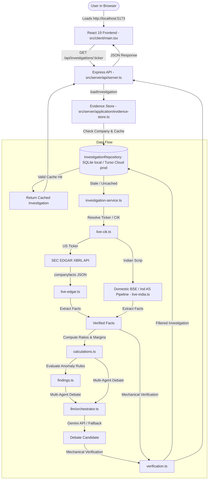

# FINVESTIGATE — Current State Handoff Document

> **Notice for Reader/LLM:** This document represents the **actual verified state** of the FINVESTIGATE codebase as of September 2026. It reflects the refactored modular 3-tier architecture (`client`, `server`, `shared`), the strict dual-adapter persistence layer (local development via SQLite / `better-sqlite3` and production persistence via Turso Cloud / `@libsql/client`), and 110 passing automated tests across 15 test suites.

---

# 1. Project Overview

- **Project Name:** FINVESTIGATE
- **One-Sentence Description:** An evidence-first financial investigation web application that presents structured financial metrics, rule-based anomaly detection, verifiable claim checks, and adversarial Bull/Bear/Judge debate cases directly traceable to SEC EDGAR and statutory regulatory filings.
- **Problem Solved:** Prevents ungrounded AI hallucinations in financial analysis by enforcing a strict citation verification chain (`Source → Fact → Calculation → Observation → AI Interpretation → Finding`).
- **Target Users:** Retail investors, financial analysts, and researchers seeking fast, verified financial disclosures without reading hundreds of pages of raw 10-K filings.
- **Current Capabilities:**
  - **Curated Company Analysis:** Instant loading for pre-verified benchmark tickers (`NVDA`, `AAPL`, `MSFT`, `AMD`, `GOOGL`, `INTC`) and domestic Indian statutory benchmarks (`RELIANCE`, `TCS`, `TATAMOTORS`) with pre-seeded facts, calculations, findings, management claim checks, and Bull/Bear/Judge debates.
  - **Constrained Evidence-Grounded AI Debate System:** Google Gemini LLM reasoning layer (`src/server/infrastructure/llm/`) with independent Bull (`bull-agent.ts`), Bear (`bear-agent.ts`), and Judge (`judge-agent.ts`) agents strictly constrained to an injected Evidence Pack & Registry.
  - **Atomic AI Fallback Engine:** Automatic, graceful fallback to a deterministic debate engine (`src/server/infrastructure/llm/live-debate.ts`) if the Gemini API key is missing, network times out, or verification fails.
  - **Deterministic Scoring Engine:** Pure TypeScript scoring algorithms (`src/server/domain/fundamental-scorer.ts`, `src/server/infrastructure/llm/deterministic-scorer.ts`) computing argument strength (0–10) based on evidence coverage, ratio health, and quality.
  - **Live Any-Ticker SEC EDGAR Ingestion:** Dynamic CIK lookup via SEC ticker map (`src/server/infrastructure/sources/live-cik.ts`) and real-time fetching/parsing of SEC XBRL `companyfacts` JSON (`src/server/infrastructure/sources/live-edgar.ts`).
  - **Domestic Indian Market (BSE / Ind AS) Ingestion:** Primary-source statutory accounting pipeline (`src/server/infrastructure/sources/live-india.ts`) with line-item and standard provenance.
  - **Deterministic Calculation Engine:** Pure TypeScript financial formulas (`src/server/domain/calculations.ts`) computing YoY growth, margins, cash conversion, FCF, and divergence metrics with sign-flip guard protection.
  - **Rule-Based Anomaly Detection:** Automated flag rules (`src/server/domain/findings.ts`) for Receivables outpacing Revenue (>10pp gap) and Operating Cash Flow trailing Net Income (>10pp gap).
  - **Automated Citation Verification Gate:** 3-surface mechanical rejection engine (`src/server/domain/verification.ts` & `src/server/domain/reference-validator.ts`) verifying Evidence IDs, company ownership, period alignment, numeric tolerance (0.5%), and sign-flip turnaround semantics.
  - **Interactive Evidence Chain UI:** Modular React 19 frontend (`src/client/`) featuring Trust Scoreboard, Divergence Radar, Finding Cards, Dossier Modal, Evidence Lineage, Claim Checker, Courtroom Debate Panel, Attack Center, Rejected Drawer, and Diagnostic Terminal.
- **What is NOT Currently Implemented:**
  - Conversational free-form AI chat interface / stock price prediction engine.
  - User authentication, user accounts, or custom saved portfolios.
- **Overall Status:** `WORKING` — Fully functional full-stack web application with Constrained AI Debate system, dual-adapter persistence (local SQLite in `data/finvestigate.db` and production Turso Cloud in AWS AP South Mumbai), and 110 tests across 15 test suites — 100% passing.

### Current Reality
A user opens `http://localhost:5173/`, selects a ticker (e.g., `NVDA`, `AAPL`, `RELIANCE`) or types any US ticker (e.g., `TSLA`, `AMZN`), and the system either loads curated data from the SQLite database/cache or fetches live SEC EDGAR XBRL filings, calculates financial metrics, detects anomalies, runs multi-agent debate synthesis or deterministic fallback, filters every claim through the Citation Verification Gate, and displays the complete evidence chain on screen.

---

# 2. Repository Structure

```text
d:/Projects/Finvestigate/
├── data/
│   ├── cache/                   # Cached SEC ticker maps and historical facts (reproducibility fixture)
│   ├── curated/                 # Pre-verified company benchmark JSON files (NVDA, AAPL, MSFT, AMD, etc.)
│   ├── finvestigate.db          # Local SQLite database (runtime-generated & auto-seeded; git-ignored)
│   └── raw/                     # Cached SEC EDGAR XBRL companyfacts JSONs (reproducibility fixture)
├── docs/                        # Integrity audits, forensic remediation reports & API security policy
├── scripts/                     # Benchmarks, regression tests, and reconciliation scripts
├── src/
│   ├── client/                  # Frontend Single Page Application (React 19, Vite, Vanilla CSS)
│   │   ├── components/          # Modular UI components
│   │   │   ├── AttackCenter.tsx         # Live adversarial attack simulation console
│   │   │   ├── ClaimCheckerPanel.tsx    # Executive quote vs filing actual audit panel
│   │   │   ├── DebatePanel.tsx          # Bull/Bear/Judge courtroom debate view
│   │   │   ├── DivergenceRadar.tsx      # Revenue vs AR & OCF vs Net Income radar
│   │   │   ├── DossierModal.tsx         # Evidence chain drill-down modal
│   │   │   ├── EvidenceLineage.tsx      # Interactive evidence lineage graph
│   │   │   ├── FindingCard.tsx          # Severity-coded anomaly finding card
│   │   │   ├── InvestigationBrief.tsx   # Executive summary & key metric overview
│   │   │   ├── InvestigationHeader.tsx  # Ticker search bar, quick pills & mode badge
│   │   │   ├── InvestigationTerminal.tsx# Real-time engine log & diagnostic terminal
│   │   │   ├── RejectedDrawer.tsx       # Intercepted claims audit drawer
│   │   │   └── TrustScoreboard.tsx      # Overall trust score & verification rate banner
│   │   ├── types/               # Frontend client-specific type definitions
│   │   ├── main.tsx             # React SPA entry point & root state orchestrator
│   │   └── styles.css           # Vanilla CSS design system & responsive layout styles
│   ├── server/                  # Backend service layer (Express 5 REST API)
│   │   ├── api/                 # API server entry & HTTP route handlers
│   │   │   └── server.ts        # Express server (CORS whitelist, IP rate limiter, mutation auth)
│   │   ├── application/         # Application workflow & orchestration layer
│   │   │   ├── evidence-store.ts        # Investigation cache loader & single-flight coalescing
│   │   │   └── investigation-service.ts # End-to-end ingestion pipeline runner
│   │   ├── domain/              # Core business logic, forensic math & verification gates
│   │   │   ├── calculations.ts          # Pure deterministic financial ratio formulas & sign-flip guard
│   │   │   ├── company-identity.ts      # Multi-jurisdiction company identity & normalization
│   │   │   ├── findings.ts              # Anomaly detection rules & finding synthesis
│   │   │   ├── fundamental-scorer.ts    # Deterministic fundamental scoring & factor math
│   │   │   ├── reference-validator.ts   # Referential integrity & orphan evidence check
│   │   │   └── verification.ts          # 3-surface mechanical Citation Verification Gate
│   │   ├── infrastructure/      # External adapters, persistence & third-party integrations
│   │   │   ├── db/              # Relational database repository layer
│   │   │   │   ├── repository-interface.ts # InvestigationRepository interface
│   │   │   │   ├── repository.ts           # Singleton repository accessor & factory switching
│   │   │   │   ├── sqlite-adapter.ts       # Local SQLite persistence layer (WAL mode, FKs, immutable runs)
│   │   │   │   └── turso-adapter.ts        # Production Turso Cloud persistence layer (@libsql/client)
│   │   │   ├── llm/             # Constrained Evidence-Grounded AI Debate system
│   │   │   │   ├── bear-agent.ts           # Adversarial Bear agent (grounded in filings)
│   │   │   │   ├── bull-agent.ts           # Adversarial Bull agent (grounded in filings)
│   │   │   │   ├── deterministic-scorer.ts # Zero-LLM fallback debate argument scorer
│   │   │   │   ├── evidence-pack.ts        # Compact Evidence Registry serializer for prompts
│   │   │   │   ├── judge-agent.ts          # Impartial Judge verdict evaluator
│   │   │   │   ├── live-debate.ts          # Pure deterministic fallback debate generator
│   │   │   │   ├── orchestrator.ts         # Multi-agent courtroom debate coordinator
│   │   │   │   ├── prompts.ts              # Evidence-grounded prompt templates
│   │   │   │   ├── provider.ts             # Google Gemini API client wrapper (@google/genai)
│   │   │   │   └── types.ts                # LLM agent interfaces & prompt schemas
│   │   │   └── sources/         # Regulatory filings & exchange ingestion adapters
│   │   │       ├── live-cik.ts             # Dynamic SEC ticker-to-CIK resolver
│   │   │       ├── live-edgar.ts           # SEC EDGAR XBRL companyfacts ingestion & parser
│   │   │       └── live-india.ts           # Domestic Indian market (BSE / Ind AS) statutory data
│   │   └── types/               # Server-specific domain schemas & DB entity types
│   └── shared/                  # Universal cross-tier types, schemas, and utilities
│       ├── constants/           # Shared constants (e.g. CACHE_TTL_DAYS)
│       ├── types/               # Shared Zod schemas (Fact, Calculation, Finding, Debate, etc.)
│       └── utils/               # Shared diligence & verification utility functions
├── tests/                       # Automated test suites (110 tests across 15 test files — 100% passing)
│   ├── forensic/                # Invariant, reconciliation, and verification gate tests (5 files)
│   │   ├── final-forensic-reconciliation.test.ts
│   │   ├── forensic-invariants.test.ts
│   │   ├── semantic-consistency.test.ts
│   │   ├── source-reconciliation.test.ts
│   │   └── verification.test.ts
│   ├── integration/             # Database repository (SQLite & Turso), evidence store, SEC & LLM tests (5 files)
│   │   ├── db-repository.test.ts
│   │   ├── evidence-store.test.ts
│   │   ├── live-edgar.test.ts
│   │   ├── llm-debate.test.ts
│   │   └── turso-adapter.test.ts
│   ├── security/                # Adversarial attack API & mutation auth tests (1 file)
│   │   └── attack-api.test.ts
│   └── unit/                    # Anomaly rules, calculations, scoring, and validator tests (4 files)
│       ├── anomalies.test.ts
│       ├── calculations.test.ts
│       ├── fundamental-scorer.test.ts
│       └── reference-validator.test.ts
├── index.html                   # HTML entry point for Vite frontend
├── package.json                 # Node.js dependencies & scripts
├── tsconfig.json                # Frontend TypeScript config
├── tsconfig.server.json         # Server TypeScript config
├── vite.config.ts               # Vite bundler & dev server config
└── README.md                    # System architecture & evaluation guide
```

---

# 3. Tech Stack

- **Frontend:** React 19.2, Vite 7.3, Vanilla CSS (`src/client/styles.css`), TypeScript 5.8
- **Backend:** Express 5.1, Node.js (ES Modules, `tsx` runner)
- **Database / Storage:**
  - **Strict Dual-Adapter Architecture (`InvestigationRepository`):**
    - **Local Development / Offline Default:** SQLite via `better-sqlite3` v13 (`data/finvestigate.db`). Zero-setup, fully offline, WAL mode, foreign keys (`PRAGMA foreign_keys = ON;`), and immutable run scoping. The database file is generated at runtime and ignored by Git (`.gitignore`).
    - **Production Cloud Persistence:** Turso Cloud via `@libsql/client` (`TURSO_DATABASE_URL` + `TURSO_AUTH_TOKEN`), hosted in AWS AP South (Mumbai). Preserves identical relational schema, composite run-scoped primary keys, foreign-key constraints, and atomic batch transactions (`client.batch([...], "write")`). Verified SAFE TO DEPLOY across all 13 production-readiness verification stages.
  - **Flat JSON files & Fixtures:** Versioned ground-truth and reproducibility fixtures retained under `data/cache/` (SEC ticker maps and historical facts), `data/curated/` (pre-verified benchmark datasets), and `data/raw/` (cached raw SEC filings).
  - **PostgreSQL Removed:** There is NO PostgreSQL adapter, NO `pg` dependency, and legacy `DATABASE_URL` has been completely removed.
- **Validation & Schemas:** Zod v3.24
- **Testing Framework:** Vitest v3.0 (15 test files, 110 tests — 100% passing)
- **HTTP / Security:** `cors` v2.8 with whitelisted origins, IP rate limiting, native `fetch` for regulatory APIs
- **LLM Provider at Runtime:** Google Gemini API (via `@google/genai` in `src/server/infrastructure/llm/provider.ts`) with automatic, zero-crash fallback to deterministic debate when API keys are absent or during offline testing.

---

# 4. How to Run the Project

### Installation
```bash
npm install
```

### Development
Start the API server (Port 3001) and Frontend dev server (Port 5173) in separate terminals:
```bash
# Terminal 1: Express API Server
npm run dev:api

# Terminal 2: Vite React Frontend
npm run dev:web
```

### Build & Typecheck
```bash
# Client Build (Vite + TypeScript check)
npm run build

# Server Clean & Build
npm run build:api

# Full Typecheck
npm run typecheck

# Production Start (Builds server and runs bundled JS)
npm start
```

### Testing & Benchmarking
```bash
# Run all Vitest suites once
npm test

# Run tests in watch mode
npm run test:watch

# Run LLM benchmark evaluation script
npm run benchmark:llm
```

### Environment Variables

| Variable | Required? | Purpose | Where Used | Default |
| -------- | --------- | ------- | ---------- | ------- |
| `TURSO_DATABASE_URL` | No (Production) | libSQL database URL for hosted Turso Cloud persistence | `src/server/infrastructure/db/repository.ts` | If missing, system uses local SQLite (`data/finvestigate.db`) |
| `TURSO_AUTH_TOKEN` | No (Production) | Authentication token for Turso Cloud libSQL database | `src/server/infrastructure/db/repository.ts` | `undefined` |
| `API_SECRET_KEY` | No (Production) | Shared secret required to authorize mutating attack endpoints in production | `src/server/api/server.ts` | Unrestricted in development; enforced in production |
| `GEMINI_API_KEY` | No | Google Gemini API key for constrained AI debate | `src/server/infrastructure/llm/provider.ts` | If missing, system gracefully uses deterministic fallback debate |
| `LLM_MODEL` | No | Gemini model selection | `src/server/infrastructure/llm/provider.ts` | `gemini-3.5-flash-lite` |
| `SEC_USER_AGENT` | No | User-Agent header for SEC EDGAR API compliance | `src/server/infrastructure/sources/*` | `"Finvestigate Research contact@finvestigate.dev"` |
| `PORT` | No | Express API server port | `src/server/api/server.ts` | `3001` |
| `ALLOWED_ORIGINS` | No | Comma-separated list of whitelisted CORS origins | `src/server/api/server.ts` | `http://localhost:5173,http://localhost:3000,http://127.0.0.1:5173,http://127.0.0.1:3000` |
| `NODE_ENV` | No | Execution environment (`development`, `test`, `production`) | Server and test runtime | `undefined` / `test` during Vitest |

> [!NOTE]
> Legacy `DATABASE_URL` is obsolete and has been completely removed. Local development defaults to SQLite at `data/finvestigate.db` (git-ignored). Production persistence is hosted on Turso Cloud via `TURSO_DATABASE_URL` and `TURSO_AUTH_TOKEN`.

---

# 5. Current End-to-End Architecture



---

# 6. User Flow

1. **Initial Visit:** User opens `http://localhost:5173/`.
2. **Dashboard Render:** The app defaults to analyzing `NVDA` (NVIDIA Corporation).
3. **Quick Select / Ticker Search:** User clicks a quick pill (`NVDA`, `AAPL`, `MSFT`, `AMD`, `GOOGL`, `INTC`, `RELIANCE`, `TCS`, `TATAMOTORS`) or inputs an arbitrary US ticker (e.g. `TSLA`, `AMZN`) and clicks **Investigate**.
4. **API Request:** Frontend issues `GET http://localhost:3001/api/investigations/:ticker`.
5. **Backend Ingestion & Processing:**
   - Single-flight in-memory promise coalescing deduplicates concurrent queries for the same ticker.
   - If ticker exists in SQLite and TTL is valid (`< 7 days`), the cached investigation is returned.
   - If uncached or stale, `runFullPipeline()` resolves the company, extracts XBRL/regulatory facts, calculates 10 financial ratios, evaluates anomaly rules, synthesizes findings, runs Bull/Bear/Judge debate (with automatic fallback), validates every citation through the Verification Gate, and commits immutable run records to SQLite.
6. **Results Rendering:**
   - **Header & Pill Status:** Company name, CIK, and jurisdiction badge (`CURATED BENCHMARK`, `LIVE EDGAR INGESTION`, or `DOMESTIC BSE / Ind AS`).
   - **Trust Scoreboard:** Real-time trust score, citation verification rate, evidence count, and intercepted claim tally.
   - **Executive Summary Brief:** Verified facts count, anomaly summary, and the Judge's biggest unresolved question.
   - **Divergence Radar:** Visual graphic highlighting divergence between Cash Flow vs Net Income and Receivables vs Revenue.
   - **Findings List & Dossier Modal:** Severity-coded cards (`CRITICAL`, `HIGH`, `MEDIUM`, `INFORMATIONAL`); clicking opens an evidence lineage modal tracing `Source → Fact → Calculation → Anomaly → Finding`.
   - **Management Claim Checks:** Executive quotes vs verified statutory filing numbers.
   - **Bull vs Bear Panel & Judge Verdict:** Verified arguments scored 0–10 with factor breakdowns and provenance badges (`🤖 AI EVIDENCE-GROUNDED` vs `⚙️ DETERMINISTIC FALLBACK`).
   - **Attack Center:** Live adversarial attack simulator allowing users to test mechanical gate resistance against fabricated IDs, cross-company references, numeric hallucinations, and sign-flip inversions.
   - **Rejected Drawer:** Collapsible drawer displaying claims discarded by the verification gate.

---

# 7. Frontend Deep Dive

### Entry Point: `src/client/main.tsx`
- **Route:** `/` (Single Page Application)
- **State Management:** React `useState`, `useEffect` with abort-safe HTTP fetching from `/api/investigations/:ticker`.
- **Styling:** Vanilla CSS design system (`src/client/styles.css`) using CSS custom properties, glassmorphism, responsive grid layouts, and color-coded severity badges.

### Component Breakdown (`src/client/components/`)

| Component | Status | Description |
| --------- | ------ | ----------- |
| `InvestigationHeader.tsx` | `IMPLEMENTED` | Ticker input, search button, quick select pills, and mode badge (`CURATED BENCHMARK`, `LIVE EDGAR INGESTION`, `DOMESTIC BSE / Ind AS`). |
| `TrustScoreboard.tsx` | `IMPLEMENTED` | Banner displaying overall trust score, citation verification %, evidence count, and blocked claims count. |
| `InvestigationBrief.tsx` | `IMPLEMENTED` | Executive summary, core financial indicators, and Judge's primary unresolved question. |
| `DivergenceRadar.tsx` | `IMPLEMENTED` | Visual indicators of accounting divergence (Receivables vs Revenue, OCF vs Net Income). |
| `FindingCard.tsx` | `IMPLEMENTED` | Severity-coded finding cards (`CRITICAL`, `HIGH`, `MEDIUM`, `INFORMATIONAL`) with evidence ref tags. |
| `DossierModal.tsx` | `IMPLEMENTED` | Interactive drill-down modal displaying the full 5-tier evidence lineage for any finding. |
| `EvidenceLineage.tsx` | `IMPLEMENTED` | Graph connecting calculated metrics to underlying SEC filing facts and primary URLs. |
| `ClaimCheckerPanel.tsx` | `IMPLEMENTED` | Management quote vs audited statutory actuals comparison table. |
| `DebatePanel.tsx` | `IMPLEMENTED` | Bull and Bear debate cards, argument factor ratings, mode badge, and impartial Judge verdict card. |
| `AttackCenter.tsx` | `IMPLEMENTED` | Live attack console executing adversarial scenarios against `POST /api/investigations/:ticker/attack` to prove gate resilience. |
| `RejectedDrawer.tsx` | `IMPLEMENTED` | Audit drawer displaying claims stripped out by the Citation Verification Gate. |
| `InvestigationTerminal.tsx` | `IMPLEMENTED` | Diagnostics console displaying execution logs, cache events, and verification gate decisions. |

---

# 8. Backend Deep Dive

### Entry Point: `src/server/api/server.ts`

| Method | Endpoint | Purpose | Input | Output | Security / Auth |
| ------ | -------- | ------- | ----- | ------ | --------------- |
| `GET` | `/health` | API service health check | None | `{ status: "ok", service: "finvestigate-api" }` | Public |
| `GET` | `/api/investigations/:ticker` | Load cached or run live investigation | `ticker` path param | Full `Investigation` object | IP rate limited (120 req/60s) |
| `GET` | `/api/verification-stats` | Retrieve segregated production & adversarial audit stats | `?ticker=` optional query | Segregated audit statistics JSON | IP rate limited |
| `POST` | `/api/investigations/:ticker/attack` | Execute adversarial simulation scenario | `scenario` in JSON body | Attack result & verification log | `requireMutationAuth` (API key in prod) |

### Middleware & Security Controls
- **CORS Whitelist (`getCorsOptions`):** Restricts access to configured origins (`DEFAULT_ALLOWED_ORIGINS` or `ALLOWED_ORIGINS`). Requests without Origin (e.g. server-to-server, curl, tests) are permitted.
- **Fixed-Window IP Rate Limiter (`rateLimiter`):** Enforces a maximum of 120 requests per 60-second window per client IP (bypassed in test mode unless `TEST_RATE_LIMIT=true`).
- **Mutation Authorization Gate (`requireMutationAuth`):** Protects mutating endpoints (`/attack`). In production, requires `Authorization: Bearer <token>` or `X-API-Key: <token>` matching `API_SECRET_KEY`.

### Application Services
- `src/server/application/evidence-store.ts`:
  - Process-local single-flight concurrency lock (`inFlightInvestigations` Map) to coalescing concurrent requests for the same ticker.
  - Multi-tiered cache resolution: checks SQLite database and TTL freshness (`CACHE_TTL_DAYS = 7`).
  - Evaluates and patches missing fundamental scores and verification stats on cache retrieval.
- `src/server/application/investigation-service.ts`:
  - End-to-end pipeline runner (`runFullPipeline`): orchestrates ticker resolution, regulatory data ingestion (SEC EDGAR or BSE/Ind AS), deterministic calculation engine, anomaly detector, and multi-agent debate synthesis.

---

# 9. Data Architecture & Database Schema

### Authoritative Persistence Engine: Strict Dual-Adapter Architecture
- **Repository Interface:** Defined in `src/server/infrastructure/db/repository-interface.ts` (`InvestigationRepository`), abstracting all persistence operations behind async TypeScript signatures.
- **Local Engine (Development / CI Default):** SQLite 3 via `better-sqlite3` v13 (`src/server/infrastructure/db/sqlite-adapter.ts`). Operates on `data/finvestigate.db` (runtime-generated and ignored by Git). Runs in WAL journal mode (`PRAGMA journal_mode = WAL;`), enforces foreign keys (`PRAGMA foreign_keys = ON;`), and requires zero external credentials or network connectivity.
- **Production Engine (Cloud Persistence):** Turso Cloud via `@libsql/client` (`src/server/infrastructure/db/turso-adapter.ts`). Hosted in AWS AP South (Mumbai) under the database name `finvestigate`. Automatically activated when `TURSO_DATABASE_URL` and `TURSO_AUTH_TOKEN` are set in the environment. Uses atomic multi-statement write batches (`client.batch([...], "write")`) for single-round-trip transaction atomicity, maintaining identical schema, composite keys, and foreign-key integrity.
- **Factory Switching (`src/server/infrastructure/db/repository.ts`):** Dynamically instantiates `TursoAdapter` when `TURSO_DATABASE_URL` is configured, otherwise instantiates `SqliteAdapter`. Local development and test runs require zero Turso credentials.
- **Immutable Run Architecture:** Every investigation execution creates a unique `run_id` in `investigation_runs`. Previous runs are marked `is_current = 0`, preserving complete historical auditability without deleting prior runs.
- **Ground-Truth & Reproducibility Fixtures:** The repository retains versioned static fixtures under `data/cache/` (SEC ticker maps and historical facts), `data/curated/` (pre-verified benchmark datasets), and `data/raw/` (cached raw SEC filings).

### Relational Table Schemas

| Table Name | Primary Key | Foreign Keys | Indexing | Purpose |
| ---------- | ----------- | ------------ | -------- | ------- |
| `companies` | `ticker TEXT PRIMARY KEY` | None | Primary Key | Master company registry, CIK, live vs curated status, and fetch timestamps. |
| `investigation_runs` | `run_id TEXT PRIMARY KEY` | `company_ticker -> companies(ticker)` ON DELETE CASCADE | `idx_runs_company` | Immutable history of all investigation executions, run timestamps, and current active run pointers. |
| `facts` | `PRIMARY KEY (run_id, fact_id)` | `run_id -> investigation_runs(run_id)` ON DELETE CASCADE<br>`company_ticker -> companies(ticker)` ON DELETE CASCADE | `idx_facts_company_metric`, `idx_facts_run` | Primary reported regulatory facts with statement, line item, accounting standards, and source URLs. |
| `calculations` | `PRIMARY KEY (run_id, calc_id)` | `run_id -> investigation_runs(run_id)` ON DELETE CASCADE<br>`company_ticker -> companies(ticker)` ON DELETE CASCADE | `idx_calc_company_metric`, `idx_calc_run` | Derived financial metrics and ratios with JSON-encoded input fact lineage and sign-flip flags. |
| `claim_checks` | `PRIMARY KEY (run_id, claim_id)` | `run_id -> investigation_runs(run_id)` ON DELETE CASCADE<br>`company_ticker -> companies(ticker)` ON DELETE CASCADE | `idx_claims_run` | Management quotes and guidance vs actual comparisons. |
| `findings` | `PRIMARY KEY (run_id, finding_id)` | `run_id -> investigation_runs(run_id)` ON DELETE CASCADE<br>`company_ticker -> companies(ticker)` ON DELETE CASCADE | `idx_findings_company`, `idx_findings_run` | Forensic anomalies with paired calculationRefs and evidence items. |
| `debates` | `PRIMARY KEY (run_id, debate_id)` | `run_id -> investigation_runs(run_id)` ON DELETE CASCADE<br>`company_ticker -> companies(ticker)` ON DELETE CASCADE | `idx_debates_company`, `idx_debates_run` | Bull, Bear, and Judge courtroom arguments with persisted `mode` (`ai_grounded` \| `deterministic_fallback`) and `run_id`. |
| `verification_log` | `PRIMARY KEY (run_id, verification_id)` | `run_id -> investigation_runs(run_id)` ON DELETE CASCADE | `idx_verification_log_company`, `idx_verification_log_source`, `idx_verification_log_run` | Tamper-evident mechanical citation gate audit trail segregating `production` and `adversarial` traffic. |

---

# 10. FINVESTIGATE Evidence Model

All domain types are enforced using Zod schemas defined in `src/shared/types/index.ts` and `src/server/types/index.ts`:

| Concept | Schema | File | Purpose |
| ------- | ------ | ---- | ------- |
| **FACT** | `FactSchema` | `src/shared/types/index.ts` | Directly reported statutory number from SEC XBRL or BSE filing with statement and URL. |
| **CALCULATION** | `CalculationSchema` | `src/shared/types/index.ts` | Deterministic TypeScript formula output linking to input Fact IDs. |
| **OBSERVATION / ANOMALY** | `AnomalySchema` | `src/shared/types/index.ts` | Flagged rule trigger comparing calculations and metrics. |
| **FINDING** | `FindingSchema` | `src/shared/types/index.ts` | Labeled forensic assessment linking to calculationRefs and evidence items. |
| **CLAIM CHECK** | `ClaimCheckSchema` | `src/shared/types/index.ts` | Executive forward-looking quote compared against verified statutory filings. |
| **DEBATE** | `DebateSchema` | `src/shared/types/index.ts` | Bull case, Bear case, and Judge verdict with argument strength scores and mode. |
| **INVESTIGATION RUN** | `InvestigationRunSchema` | `src/server/types/index.ts` | Metadata tracking each execution run (`run_id`, `is_current`, `run_type`). |
| **VERIFICATION LOG** | `VerificationLogSchema` | `src/server/types/index.ts` | Mechanical citation gate log recording claim passes and detailed failure reasons. |

**Active Evidence Chain Hierarchy:**  
$$\text{Filing Source Fact} \longrightarrow \text{Deterministic Calculation} \longrightarrow \text{Anomaly Observation} \longrightarrow \text{Verified Finding} \longrightarrow \text{Courtroom Debate}$$

---

# 11. Financial Calculation Engine

Located in `src/server/domain/calculations.ts`:

| Metric | Formula | Deterministic? | Sign-Flip Handled? |
| ------ | ------- | -------------- | ------------------ |
| `revenue_growth_yoy` | `(Rev_t - Rev_{t-1}) / Rev_{t-1}` | Yes | Yes |
| `operatingCashFlow_growth_yoy` | `(OCF_t - OCF_{t-1}) / OCF_{t-1}` | Yes | Yes |
| `netIncome_growth_yoy` | `(NI_t - NI_{t-1}) / NI_{t-1}` | Yes | Yes (Turnaround logic) |
| `receivables_growth_yoy` | `(AR_t - AR_{t-1}) / AR_{t-1}` | Yes | Yes |
| `grossMargin` | `GrossProfit / Revenue` | Yes | N/A |
| `operatingMargin` | `OperatingIncome / Revenue` | Yes | N/A |
| `cashConversionRatio` | `OperatingCashFlow / NetIncome` | Yes | Yes |
| `freeCashFlow` | `OperatingCashFlow - CapEx` | Yes | N/A |
| `receivables_vs_revenue_divergence` | `AR_growth - Rev_growth` | Yes | Yes |
| `ocf_vs_net_income_divergence` | `OCF_growth - NI_growth` | Yes | Yes |

### Sign-Flip Guard & Math Safety
Standard percentage growth formulas break when prior numbers cross zero or are negative (e.g., net loss swinging to net profit). Rather than producing misleading figures (e.g. $-1200\%$) or division-by-zero errors, the engine sets `sign_flip: true` and attaches qualitative turnaround labels (`"Turnaround from net loss to net profit"` or `"Deterioration from net profit to net loss"`).

---

# 12. Anomaly & Findings Engine

Located in `src/server/domain/findings.ts`:

1. **Rule `RULE-AR-REV-01` (Receivables Outpacing Revenue):**
   - **Condition:** `receivables_growth_yoy > revenue_growth_yoy + 0.10` (Receivables growth exceeds Revenue growth by >10 percentage points).
   - **Severity:** `MEDIUM`
   - **Diagnostic:** Indicates aggressive revenue recognition, channel stuffing, or weakening customer collections.
2. **Rule `RULE-OCF-NI-01` (Cash Flow Divergence):**
   - **Condition:** `operatingCashFlow_growth_yoy < netIncome_growth_yoy - 0.10` (Operating Cash Flow growth trails Net Income growth by >10 percentage points).
   - **Severity:** `MEDIUM`
   - **Diagnostic:** Indicates low-quality earnings driven by accruals or uncollected paper revenues rather than physical cash generation.

---

# 13. LLM Architecture & Citation Verification Gate

### Constrained Multi-Agent Debate Engine (`src/server/infrastructure/llm/`)
- **Bull Agent (`bull-agent.ts`):** Synthesizes positive financial thesis strictly using verified Evidence Pack IDs.
- **Bear Agent (`bear-agent.ts`):** Synthesizes risk thesis focusing on cash conversion, margin pressures, and anomalies.
- **Judge Agent (`judge-agent.ts`):** Evaluates competing arguments, identifies unresolved questions, and scores overall evidence quality.
- **Evidence Pack (`evidence-pack.ts`):** Serializes a compact token-efficient registry of verified Facts, Calculations, and Anomalies. Agents are instructed that citing any ID not in the registry is a violation.
- **Deterministic Scorer (`deterministic-scorer.ts` / `fundamental-scorer.ts`):** TypeScript engine computing objective 0–10 argument strength scores based on evidence breadth, ratio health, and anomaly severity.

### Mechanical Citation Verification Gate (`src/server/domain/verification.ts`)
Every statement and argument generated by LLMs or deterministic rules passes through an automated verification barrier before being committed to the database or returned to the UI:
1. **Evidence ID Existence Check:** Ref_id must exist in the database for the active investigation.
2. **Company Ownership Check:** Ref_id must belong strictly to the target company (bidirectionally blocks cross-company contamination, e.g., between Indian `RELIANCE` and US `RS` Reliance Steel).
3. **Period Alignment Check:** Referenced filing period must match the claimed period (e.g. FY2024 claim cannot cite FY2023 fact).
4. **Numeric Tolerance Gate:** Claimed numeric values must match stored database values within a strict **0.5% tolerance window**.
5. **Sign-Flip Inversion Check:** Turnaround metrics must match qualitative turnaround labels rather than inverted mathematical percentages.
6. **Multi-Surface Verification:** Evaluates Bull/Bear arguments, Findings, and Claim Checks independently.
7. **Atomic Fallback:** If any LLM argument fails verification, the orchestrator immediately discards the entire AI debate and falls back to the deterministic debate generator (`mode: "deterministic_fallback"`), guaranteeing zero hallucinations reach the user.

---

# 14. Prompts

Located in `src/server/infrastructure/llm/prompts.ts`:
- **Bull Agent Prompt:** Directs the model to act as a forensic financial bull, strictly citing IDs from the Evidence Registry, using numeric figures exact to 0.5%, and prohibiting ungrounded speculation.
- **Bear Agent Prompt:** Directs the model to act as a forensic short seller, highlighting divergences, working capital drags, and margin compression using exact Evidence Registry references.
- **Judge Agent Prompt:** Directs the model to act as an impartial magistrate, identifying unaddressed risks and formulating the primary unresolved question for financial analysts.

---

# 15. Schemas and Types

- **Shared Domain Schemas (`src/shared/types/index.ts`):**
  `FactSchema`, `CalculationSchema`, `AnomalySchema`, `FindingSchema`, `ClaimCheckSchema`, `DebateSchema`, `PeriodSchema`, `EvidenceItemSchema`.
- **Server Domain Schemas (`src/server/types/index.ts`):**
  `InvestigationSchema`, `InvestigationRunSchema`, `VerificationLogSchema`, `CompanyRowSchema`.
- **Client Schemas (`src/client/types/index.ts`):**
  UI view state types, tab definitions, and modal state models.

---

# 16. APIs and External Data Sources

| Source | Purpose | Live at Runtime? | Cached? | Auth / Identifier | Implementation File |
| ------ | ------- | ---------------- | ------- | ----------------- | ------------------- |
| **SEC EDGAR Ticker Map** | Resolve ticker to 10-digit zero-padded CIK | Yes (live US tickers) | In-memory | User-Agent header | `src/server/infrastructure/sources/live-cik.ts` |
| **SEC EDGAR XBRL Facts** | Download raw companyfacts JSON filings | Yes (live US tickers) | SQLite & `data/raw/` | User-Agent header | `src/server/infrastructure/sources/live-edgar.ts` |
| **BSE / Ind AS Registry** | Primary-source Indian corporate filings | Yes (Indian scrips) | SQLite | Statutory disclosures | `src/server/infrastructure/sources/live-india.ts` |
| **Google Gemini API** | Multi-agent courtroom debate synthesis | Yes (when key provided) | No (atomic fallback) | `GEMINI_API_KEY` | `src/server/infrastructure/llm/provider.ts` |

---

# 17. Curated & Benchmark Data

1. **Pre-Verified US Benchmark JSONs (`data/curated/*.json`):**
   - `nvda.json` (NVIDIA Corp)
   - `aapl.json` (Apple Inc)
   - `msft.json` (Microsoft Corp)
   - `amd.json` (Advanced Micro Devices)
   - `googl.json` (Alphabet Inc)
   - `intc.json` (Intel Corp)
2. **Domestic Indian Primary-Source Data (`live-india.ts`):**
   - `RELIANCE` (Reliance Industries Limited — BSE Scrip 500325)
   - `TCS` (Tata Consultancy Services — BSE Scrip 532540)
   - `TATAMOTORS` (Tata Motors Limited — BSE Scrip 500570)
3. **Deterministic Fallback Generator (`src/server/infrastructure/llm/live-debate.ts`):**
   - Generates fully verified Bull, Bear, and Judge arguments algorithmically from calculations and findings when offline or running without LLM API keys.

---

# 18. Testing & Quality Assurance

- **Test Framework:** Vitest v3.0 (`vitest run`)
- **Current Test Results:** **15 test files, 110 passed tests, 0 failures (100% pass rate).**

```text
Test Files  15 passed (15)
     Tests  110 passed (110)
```

### Breakdown of Test Suites

| Category | Test File | Tests | Focus Area |
| -------- | --------- | ----- | ---------- |
| **Forensic** | `tests/forensic/verification.test.ts` | 16 | Verification Gate rejection rules, numeric tolerance, cross-company security |
| **Forensic** | `tests/forensic/forensic-invariants.test.ts` | 10 | Immutable runs, idempotent seeding, round-trip debate modes |
| **Forensic** | `tests/forensic/semantic-consistency.test.ts` | 10 | Multi-jurisdiction semantic consistency, sign-flip transitions |
| **Forensic** | `tests/forensic/source-reconciliation.test.ts` | 4 | Regulatory source reconciliation and line-item provenance |
| **Forensic** | `tests/forensic/final-forensic-reconciliation.test.ts` | 5 | End-to-end reconciliation across benchmark companies |
| **Integration**| `tests/integration/db-repository.test.ts` | 8 | SQLite repository, concurrency locks, TTL cache invalidation |
| **Integration**| `tests/integration/turso-adapter.test.ts` | 10 | Turso / libSQL adapter, schema initialization, atomic write batches, round-trip |
| **Integration**| `tests/integration/evidence-store.test.ts` | 2 | Investigation loading, caching, and fallback debate enrichment |
| **Integration**| `tests/integration/llm-debate.test.ts` | 5 | Constrained LLM debate, adversarial injection rejection, atomic fallback |
| **Integration**| `tests/integration/live-edgar.test.ts` | 5 | Live SEC EDGAR XBRL ingestion, CIK lookup, volatile ticker handling |
| **Security**   | `tests/security/attack-api.test.ts` | 8 | Adversarial attack endpoints, scenario validation, mutation authorization |
| **Unit**       | `tests/unit/calculations.test.ts` | 8 | Deterministic financial formulas, ratio calculations, sign-flip guard |
| **Unit**       | `tests/unit/anomalies.test.ts` | 5 | Rule-based divergence triggers (Receivables vs Revenue, OCF vs Net Income) |
| **Unit**       | `tests/unit/fundamental-scorer.test.ts` | 10 | Fundamental strength scoring, factor weighting, and quality metrics |
| **Unit**       | `tests/unit/reference-validator.test.ts` | 4 | Referential integrity validator, orphan detection, reference graphs |

---

# 19. Current Build & Runtime Status

- **TypeScript compilation (`npm run typecheck`):** `PASSING` (Zero type errors)
- **Client Production Build (`npm run build`):** `PASSING` (Vite bundle built in ~800ms)
- **Server Production Build (`npm run build:api`):** `PASSING` (Compiles cleanly to `server-dist/`)
- **Full Test Suite (`npm test`):** `PASSING` (110/110 tests passed across 15 test files)
- **API Server (`npm run dev:api`):** `FUNCTIONAL` on `http://localhost:3001`
- **Frontend Dev Server (`npm run dev:web`):** `FUNCTIONAL` on `http://localhost:5173`

### Final Remote Turso Cloud Verification Status

The production database was deployed and verified against the **actual remote Turso Cloud database** (`finvestigate`, hosted in AWS AP South Mumbai):

- **13-Stage Production Verification:** All 13 stages passed against remote Turso Cloud:
  1. *Connectivity:* PASS
  2. *Schema Integrity & Composite Primary Keys:* PASS
  3. *Foreign Key Enforcement:* PASS (`PRAGMA foreign_keys = ON;`)
  4. *Transaction Atomicity:* PASS (Atomic write batch execution via `client.batch([...], "write")`)
  5. *Idempotent Seeding:* PASS (Zero duplicate seed records across multiple cycles)
  6. *Investigation Roundtrip:* PASS (Full persistence and reload of facts, calculations, findings, debates, logs)
  7. *Immutable History:* PASS (Run 1 preserved unmodified when Run 2 is created)
  8. *Concurrency:* PASS (Process-local coalescing prevents concurrent duplicate pipeline runs)
  9. *Application End-to-End:* PASS (Full pipeline execution against live remote Turso)
  10. *Restart / Persistence:* PASS (Data survives server process termination and restart)
  11. *Local Regression:* PASS (15 test files, 110 tests, 0 failures)
  12. *Security Audit:* PASS (Zero leaked credentials or uncommitted secrets)
  13. *Remote Test Cleanup:* PASS (Temporary test entities and adversarial test records cleaned)
- **Final Verdict:** `SAFE TO DEPLOY`
- **Remote Data Verification:**
  - Curated NVDA investigation persisted and verified remotely: 10 facts, 7 calculations, 1 finding, full AI/deterministic debate, factor weights, and 296 NVDA verification audit logs.
  - Production verification log total across retained production companies (`NVDA`, `AAPL`, `MSFT`): **318 production verification logs**.
- **Remote API Verification:** Verified with `NODE_ENV=production`, `TURSO_DATABASE_URL`, `TURSO_AUTH_TOKEN`, and `API_SECRET_KEY`:
  - `GET /health` → HTTP 200
  - `GET /api/verification-stats?ticker=NVDA` → HTTP 200
  - `GET /api/investigations/NVDA` → HTTP 200
  - `POST /api/investigations/NVDA/attack` without API key → HTTP 401 Unauthorized
  - `POST /api/investigations/NVDA/attack` with valid API key → HTTP 200 OK
  - Adversarial attack detection & atomic fallback → PASS

---

# 20. Current Feature Matrix

| Feature | Status | Evidence | Primary Source Files |
| ------- | ------ | -------- | -------------------- |
| Ticker Search & Selection | ✅ Implemented | Tested Live | `src/client/components/InvestigationHeader.tsx` |
| Live SEC EDGAR XBRL Ingestion | ✅ Implemented | Integration Tested | `src/server/infrastructure/sources/live-edgar.ts`, `live-cik.ts` |
| Domestic Indian Market (BSE) | ✅ Implemented | Forensic Tested | `src/server/infrastructure/sources/live-india.ts` |
| Deterministic Math Engine | ✅ Implemented | Unit Tested | `src/server/domain/calculations.ts` |
| Sign-Flip Transition Guard | ✅ Implemented | Unit Tested | `src/server/domain/calculations.ts` |
| Divergence Anomaly Detection | ✅ Implemented | Unit Tested | `src/server/domain/findings.ts` |
| Mechanical Verification Gate | ✅ Implemented | Forensic Tested | `src/server/domain/verification.ts` |
| Referential Integrity Check | ✅ Implemented | Unit Tested | `src/server/domain/reference-validator.ts` |
| Constrained AI Debate System | ✅ Implemented | Integration Tested | `src/server/infrastructure/llm/orchestrator.ts` |
| Atomic Deterministic Fallback | ✅ Implemented | Integration Tested | `src/server/infrastructure/llm/live-debate.ts` |
| Objective Argument Scoring | ✅ Implemented | Unit Tested | `src/server/domain/fundamental-scorer.ts` |
| Dual-Adapter Database Architecture | ✅ Implemented | Integration Tested | `src/server/infrastructure/db/sqlite-adapter.ts`, `turso-adapter.ts` |
| Immutable Run History | ✅ Implemented | Forensic Tested | `src/server/infrastructure/db/sqlite-adapter.ts`, `turso-adapter.ts` |
| Adversarial Attack Simulation | ✅ Implemented | Security Tested | `src/client/components/AttackCenter.tsx`, `verification.ts` |
| Full Evidence Lineage UI | ✅ Implemented | Tested Live | `src/client/components/DossierModal.tsx`, `EvidenceLineage.tsx` |

---

# 21. Known Limitations & Technical Debt

1. **Single-Process Concurrency Lock:** The single-flight request coalescing lock in `evidence-store.ts` operates in-memory (`Map<string, Promise>`). In a distributed cluster with multiple Node.js instances, an external distributed lock (such as Redis Redlock) would be necessary to coordinate across instances.
2. **SEC Non-Standard XBRL Tags:** Certain companies occasionally report standard financial items under non-standard custom taxonomy extensions. Common variants are mapped in `live-edgar.ts`, but novel custom tags may require expanding fallback tag lists.
3. **Annual vs Quarterly Granularity:** Current live pipeline focuses on annual `10-K` filings for verified year-over-year stability. Quarterly `10-Q` multi-period trend tracking can be added as a future enhancement.

---

# 22. Original Specification vs Current Implementation

| Spec Aspect | Original Baseline Spec | Current Actual Implementation | Status |
| ----------- | ---------------------- | ------------------------------ | ------ |
| **Coverage** | 2–3 static mock companies | 6 Curated US benchmarks + 3 Indian BSE benchmarks + Any live US ticker via SEC EDGAR | Exceeded |
| **Persistence** | Flat JSON files / experimental DB | Dual-adapter repository architecture: local SQLite (`data/finvestigate.db`, git-ignored) + production Turso Cloud with WAL mode, foreign keys, and immutable run history | Exceeded |
| **LLM Integration** | Unconstrained prompt summary | Multi-agent courtroom debate (Bull, Bear, Judge) constrained to Evidence Pack with zero-crash atomic fallback | Exceeded |
| **Verification** | Basic citation check | 3-surface mechanical Citation Verification Gate (0.5% tolerance, period checks, cross-company boundary defense) | Exceeded |
| **Adversarial Testing** | None | Live Attack Center UI & authenticated REST attack endpoint executing 4 real-time injection vectors | Exceeded |
| **UI Aesthetics** | Minimal prototype | Full glassmorphic financial terminal with Radar, Trust Scoreboard, Dossier Modal, and Lineage Graph | Exceeded |

---

# 23. Recommended Next Steps

1. **Production Deployment with Turso Cloud:** Host backend with `TURSO_DATABASE_URL`, `TURSO_AUTH_TOKEN`, and `API_SECRET_KEY` configured. Remote verification certified `SAFE TO DEPLOY`.
2. **Export Capabilities:** Add structured PDF or CSV export for generated forensic investigation reports.
3. **Expanded Taxonomies:** Add concept mappings for non-standard financial sector tags (e.g. specialized bank loan loss provisions).

---

# 24. LLM Handoff Summary

### What FINVESTIGATE is right now
A production-ready, full-stack financial investigation platform built with React 19, Express 5, and a strict dual-adapter database architecture (local SQLite and production Turso Cloud). It ingests live SEC EDGAR XBRL filings and domestic statutory disclosures, computes financial ratios deterministically, detects accounting anomalies, synthesizes evidence-grounded Bull/Bear/Judge courtroom debates via Google Gemini (with atomic deterministic fallback), filters every citation through a 3-surface mechanical Verification Gate, and presents a complete, transparent evidence chain to the user.

### Key Architectural Pillars
- **Authoritative Persistence:** Dual-adapter repository architecture implementing `InvestigationRepository`:
  - **Local Development / CI:** SQLite (`data/finvestigate.db`, git-ignored) via `src/server/infrastructure/db/sqlite-adapter.ts`.
  - **Production Cloud:** Turso Cloud (`@libsql/client`, AWS AP South Mumbai) via `src/server/infrastructure/db/turso-adapter.ts`. Verified SAFE TO DEPLOY across all 13 production-readiness stages.
- **3-Tier Structure:** Client (`src/client/`), Server (`src/server/`), and Shared (`src/shared/`).
- **Constrained AI Layer:** `src/server/infrastructure/llm/` with atomic fallback in `live-debate.ts`.
- **Mechanical Gate:** `src/server/domain/verification.ts` enforcing 0.5% tolerance and cross-company defense.
- **Test Integrity:** 15 test suites, 110 passed tests (100% pass rate).

### Most Important Source Files
1. `src/client/main.tsx` — React application root & state manager.
2. `src/server/api/server.ts` — Express REST API with rate limiting, CORS policy, and mutation authorization.
3. `src/server/application/evidence-store.ts` — Cache resolution & concurrency coalescing.
4. `src/server/application/investigation-service.ts` — End-to-end live ingestion pipeline runner.
5. `src/server/infrastructure/db/repository.ts` — Repository factory switching between SQLite and Turso.
6. `src/server/infrastructure/db/sqlite-adapter.ts` — Local SQLite persistence engine.
7. `src/server/infrastructure/db/turso-adapter.ts` — Production Turso Cloud persistence engine.
8. `src/server/domain/verification.ts` — 3-surface mechanical Citation Verification Gate.
9. `src/server/domain/calculations.ts` — Pure deterministic financial formulas & sign-flip guard.
10. `src/server/infrastructure/llm/orchestrator.ts` — Multi-agent courtroom debate orchestrator.
